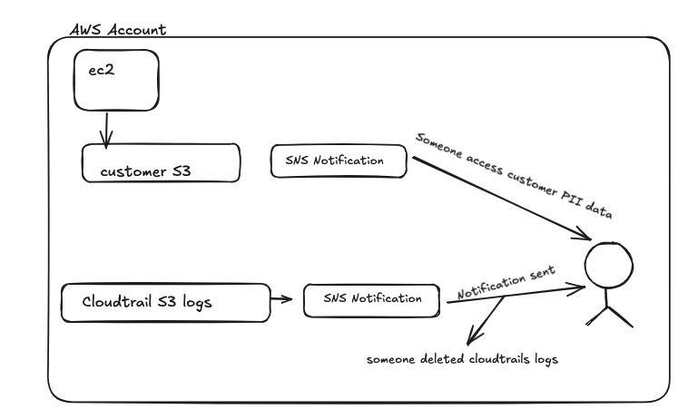
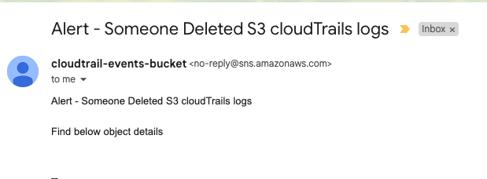
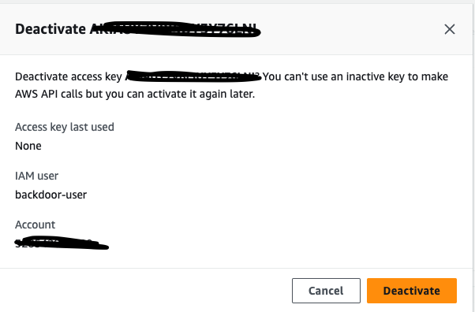
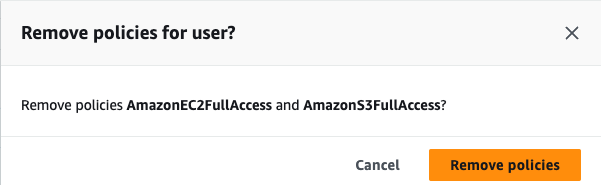

# AWS Account Compromised

## Description

Architecture: The EC2 instance hosts a simple API which uses an S3 bucket to store files. These
files are sent to authenticated users when an API request is executed. IAM identities and roles are
used with least privilege principles to only access what’s necessary. CloudTrail and CloudWatch
are used for their intended monitoring services.

### threat actor activity

Task 1: Initial Access
Scenario: A compromised IAM user account was used to access your AWS environment.
Task 2: Persistence
Scenario: The attacker has created a backdoor IAM user with elevated privileges.
Task 3: Privilege Escalation
Scenario: The attacker exploited an IAM role to escalate privileges.
Task 4: Defense Evasion
Scenario: The attacker modified CloudTrail logging to evade detection.
Task 5: Exfiltration
Scenario: The attacker exfiltrated sensitive data from the S3 bucket and EC2 instance

### Incident Response

Assuming following Architecture

**Alert** received about someone deleted cloudtrail logs in s3 bucket

**Investigations started**

Found the backdoor user deleted those cloudtrails events logs

**Immediate action:**
- deactivate the users and kill the existing sessions
- Removed the attached permissions

**Question: who created this user?**

In the cloudtrail events logs found that, this user create by a another user which also seems to compromised

**Immediate action:**

- deactivate the compromised user and kill the existing sessions
- Removed the attached permissions

**Recommendations**

- Enforce all the AWS console user MFA login and allow only least privileges
- Machine users to allow only least privileges and there should be rotate mechanism for the keys
- Periodically run IAM access analyzer, which helps to mitigate the excessive privileges
- EC2 API server should be only IAM role access for S3 bucket
- Add Alerts on users creation with Administrator privileges
- Make sure S3 bucket default public access disabled
- Add S3 Bucket policy to allow only from same account VPC the data
- Look for VPC flow logs, how the data is flowing
- Look for S3 API calls, download and upload the data
- Enable encryption for PII data
- Track the S3 data events
- Continues monitor the user activities and add alerts on PII data access
- EC2 API should able access 443 port with auth mechanism
- EC2 API → API management to implement to avoid brute force attack
